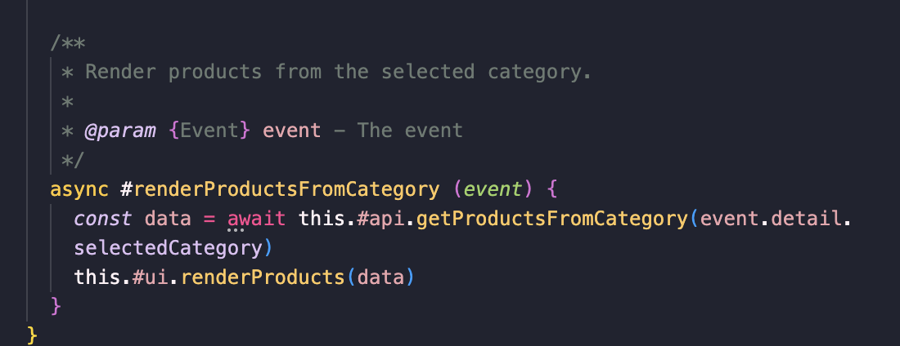
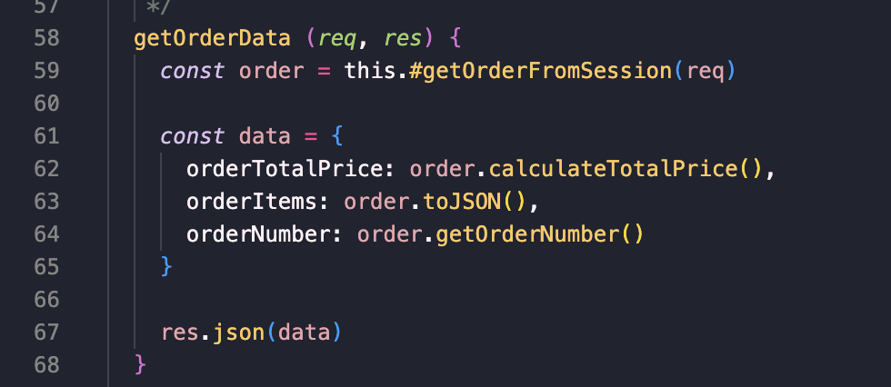

# Reflection L3
## Chapter 2 - Names
I have tried to continue to be careful when giving the classes, variables and function names. The names are sometimes a bit longer, but still readable to give extra information to the context to make it more understandable. Names used within this specific field has been used to make it understandable for most people what's going on in the code.

I chose to use some longer names to make it easier to understand the context, even if the readability got lower.

E.g the function name `renderProductsFromCategory` is a bit longer, but it also gives the reader enough context to understand what the function does without having to read and understand all of the code inside.


## Chapter 3 - Functions
For this project I have tried to write the code with higher abstraction, but honestly I've been struggling to know how to decouple the classes sometimes, espeecially in the front end.

I tried to divide it into several classes, the OrderSystemApi handles the sending and fetching data to the backend while the OrderSystemUI renders and handles the view, while the StoreController is like the orchestrator which connects these two classes to be able to render data from the backend in the front end, and send data to the backend.

In the backend I thought it was easier to keep the models, controllers, and logic layers seperated but in the front end I honestly struggled with keeping the front.


I've tried to write the code with higher abstraction to make it easier to follow the code. E.g here when an order item is being deleted, the code is hid inside these functions instead of having all of the code in the same function. Each subfunction does one thing.

When writing the code I tried thinking about not having to use too many arguments. Most of the time I only use monadic and dyadic functions.


## Chapter 4 - Comments
JSDoc has been used as the standard for this project together with the linter from LNU. I have tried to not make the comments unnecessary but I do feel like the comments are a bit too obvious sometimes but because of the JSDoc I have followed the lint and therefore sometimes added comments which perhaps could be considered unnecessary or overexplaining.

Console.logs has been removed, trying to tidy up the code even tho lots of console.logs have been used during development.

With using JS Doc, it becomes a bit repetitive, I think by reading the name of the name of the function and the parameter you would already understand what the function does without the JS Doc. However I chose to follow the JS Doc and lint standard because it will be more clear for other developers working with this code when they can have everything documented clearly. The JS Doc also help the UI in VS Code because we get more information when hovering over the functions and objects.




## Chapter 5 - Formatting
When writing the code I tried to keep the length of the functions horisontally short if possible.

Vertically, the file sometimes became too long. Most of the times the files are not over 200 lines and they have been seperated to each focus on one task, therefore the files were rarely too long.

Only in one class I struggled with the file-length. In the `StoreController` in the front end, the class which acts as an orchestrator between the class that retrieves and sends data and the UI. I thought it was difficult to know how to divide the class into smaller parts to keep it shorter since a lot of the code is used to create HTML-elements and set their attributes. If I would have used web components instead this issue would have been solved and the files would have been more modular, flexible and shorter but due to time I couldn't refactor and redo the UI.

To keep the indentation correct to enhance readability the extension Prettier has been used along with the eslint from LNU.


## Chapter 6
Law of Demeter says that a module should only communicate with an object with its a field from its own class, an object created by the function or an object which has been passed in as an argument.

To avoid breaking the law of Dermeter by not calling a method directly on the returned object. Instance I divided it like this to avoid creating a chain of method-calls. I did not do it like this:
```js
const orderTotalPrice = this.#getOrderFromSession(req).calculateTotalPrice()
```
Instead I chose to divide it like this to only reach the public methods on the order-object.


Both in the front end and backend - I've tried to write it as OOP as I could. Instead of using magic numbers or painted types, I have tried creating classes. In this way it is possible to encapsulate behaviour and attributes. Fields and methods that shouldn't be accessiable outside its class has been set to private to avoid missuse and bugs.


## Chapter 7
Through out the program exceptions are thrown when something goes wrong. This is mostly implemented on the backend. There is validation in the backend which checks the incoming data, and if it's not the data/type we expected an Exception wll be thrown.

In this appplication I have tried to avoid return codes and only throw Exceptions. I don't return NullObjects, instead if something is not found an exception will be thrown.

However, unfortunately one major improvement that I didn't implement is handling the errors in a try-catch on the front end. Right now I have not implemented displaying the error messages or communicating that some is wrong to the user. The error handling implemented is mainly in the backend where the server errors are logged to the developer.
## Chapter 8
Honestly, I did find it hard to know how to have clean boundaries as they explain in Clean Code. Benefits of having clear boundaries between your application and the module or third-part library you use is that you will not have to worry as much if something in the third-part changes, then you only have to update the adapter.

I did not create any adapter on the backend, I only create instances of the classes from my module from L2. I probably should have kept better boundaries between the code from L2 and the code from L3, but I don't know how I should've made an adapter in this case.

Since I was the one who created the module used for this project I didn't write particular test learning cases for understanding my third-part code. Although jest tests were made when developing and testing the module to make sure it behaves as aspected, but I never created tests for how it should be used in my application.

## Chapter 9
Unit tests have not been used when creating the tests for the application. Unit tests were made with jest for the module.

**TDD**
The Three Laws of TDD:
```
You may not write production code until you have written a failing unit test
```


```
You may not write more of a unit test than is sufficient to fail, and not compiling is failing
````

````
You may not write more production code than is sufficient to pass the currently failing test
````

I did not follow these rule when writing the tests for L2 since we hadn't read about these rules yet. I implemented the tests along the way while writing the code to try to see if the methods worked properly. My way of working was not test driven since I lack experience and knowledge in how to do it.

I did the opposite, I wrote the production code first and then the tests but I tried to test the code while writing it.

When creating the tests, I tried to keep the tests clean and check that each test case test one thing. Just like clean code, the tests have to be clean as well with high readability. When writing the test code I tried to keep the functions not too long and with logic names for the context.

**FIRST**
According to the FIRST rules for testing most of the rules apply to my tests. The tests are fast to run, the tests are made with jest and can be ran by using the command `npm run test`. They are independent of each other, each test-file only test one class and its methods. I tried to not make it coupled, unless one class was dependent on another class. The tests are selfvalidating and they always return true or false to determine whether the test has passed or failed. The test are repeatable and are written in a time close to when the production code was written.

## Chapter 10
I tried to keep the classes not too big, and that each class has responsible for one thing. The framework Express has been used in this project where I try to follow the MVC structure. Different classes has been made for the business logic, routers, controllers and the front end. 

When creating the classes I always had encapsulation in and tried to make fields and methods private if they no one outside of the class should have access to them. 

I may have broken the single responsibility principle, especially in the front end. I struggled with the structure and how to organize my classes in the front end since they created all of the HTML-elements dynamically. I think it would had been a lot easier if I hade built webcomponents instead of rendering each element with its attributes by using `document.createElement()` and append other subelements and attributes this way. The class `OrderSystemUI` got a bit too long, but I did not know how to refactor it. I think it is very hard to know how to decouple classes while keeping high cohesion.

## Chapter 11

## Summary
Overall this has been an interesting project, to develop both the module, refactor it and then create the app based on our own module. Personally I felt that it was difficult to implement everything I had wanted during the given time but at least I could manage to provide the basic functionality to simulate how I would want the app to work.

Due to lack of time I chose to not implement and deploy the database, that is why some things are hardcoded.

I feel like there are a lot of improvements in my code but I struggled with the analyse and design of how to put together the classes. At first I created a spaghetti code, which was hard to untangle. I got lost in my own design after a while when trying to refactor it, and it got messy. Next time I want to follow the principles and standards from the book from the beginning so avoid breaking the code while refactoring.

Someting I have to take into consideration for future projects, is to spend more time on the design before coding to know how to decouple classes. Personally I struggle with keeping the cohesion high with low coupling. I noticed when I'm coding, way too often the code is coupled way too tight and one class is dependent of another class in a way which probably is incorrect. In severeal places I broke against the rule where we shoud not call a method directly on the return object. 

Web components could also have been used to follow SOC, and keep the views (ejs) more clean and readable. The layout for a webcomponent has been added but due to lack of time I could not refactor the code into webcomponents, but it could be an future improvement.

Overall I have tried to write the code based on the standards in the literature Clean Code, but sometimes it is difficult to follow all of the principles. Especially when I had to refactor the code after reading more chapters, realizing I did lots of errors. 
