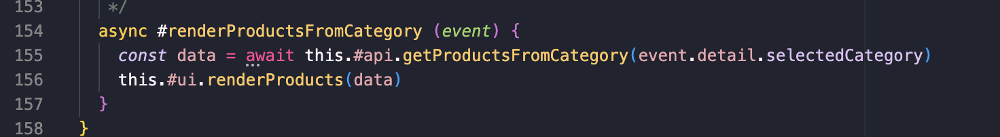
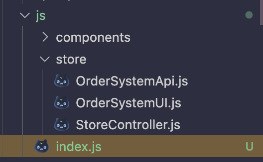
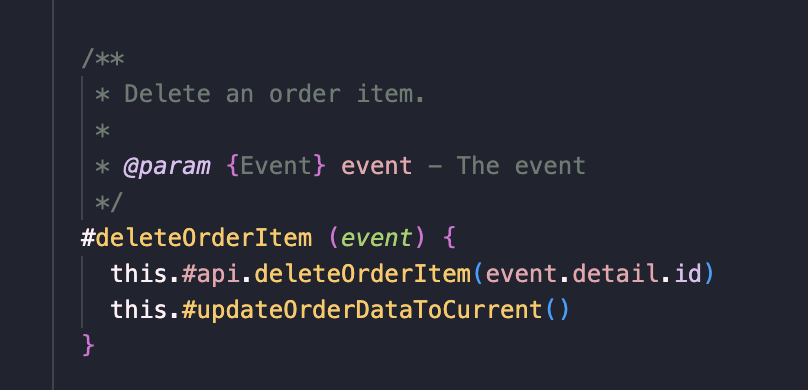

# Reflection L3
## Chapter 2 - Names
I have tried to continue to be careful when giving the classes, variables and function names. The names are sometimes a bit longer, but still readable to give extra information to the context to make it more understandable. Names used within this specific field has been used to make it understandable for most people what's going on in the code.

I chose to use some longer names to make it easier to understand the context, even if the readability got lower.

E.g the function name `renderProductsFromCategory` is a bit longer, but it also gives the reader enough context to understand what the function does without having to read and understand all of the code inside.

## Chapter 3 - Functions
For this project I have tried to write the code with higher abstraction, but honestly I've been struggling to know how to decouple the classes sometimes, espeecially in the front end.

I tried to divide it into several classes, the OrderSystemApi handles the sending and fetching data to the backend while the OrderSystemUI renders and handles the view, while the StoreController is like the orchestrator which connects these two classes to be able to render data from the backend in the front end, and send data to the backend.

In the backend I thought it was easier to keep the models, controllers, and logic layers seperated but in the front end I honestly struggled with keeping the front.

I've tried to write the code with higher abstraction to make it easier to follow the code. E.g here when an order item is being deleted, the code is hid inside these functions instead of having all of the code in the same function. Each subfunction does one thing.

When writing the code I tried thinking about not having to use too many arguments. Most of the time I only use monadic and dyadic functions.

## Chapter 4 - Comments
JSDoc has been used as the standard for this project together with the linter from LNU. I have tried to not make the comments unnecessary but I do feel like the comments are a bit too obvious sometimes but because of the JSDoc I have followed the lint and therefore sometimes added comments which perhaps could be considered unnecessary or overexplaining.

Console.logs has been removed, trying to tidy up the code even tho lots of console.logs have been used during development.

## Chapter 5
## Chapter 6
## Chapter 7
## Chapter 8
## Chapter 9
## Chapter 10
## Chapter 11

## Summary
Overall this has been an interesting project, to develop both the module, refactor it and then create the app based on our own module. Personally I felt that it was difficult to implement everything I had wanted during the given time but at least I could manage to provide the basic functionality to simulate how I would want the app to work.

Due to lack of time I chose to not implement and deploy the database, that is why some things are hardcoded.

I feel like there are a lot of improvements in my code but I struggled with the analyse and design of how to put together the classes. At first I created a spaghetti code, which was hard to untangle. I got lost in my own design after a while when trying to refactor it, and it got messy. Next time I want to follow the principles and standards from the book from the beginning so avoid breaking the code while refactoring.

Someting I have to take into consideration for future projects, is to spend more time on the design before coding to know how to decouple classes. Personally I struggle with keeping the cohesion high with low coupling. I noticed when I'm coding, way too often the code is coupled way too tight and one class is dependent of another class in a way which probably is incorrect. In severeal places I broke against the rule where we shoud not call a method directly on the return object. 

Web components could also have been used to follow SOC, and keep the views (ejs) more clean and readable. The layout for a webcomponent has been added but due to lack of time I could not refactor the code into webcomponents, but it could be an future improvement.

Overall I have tried to write the code based on the standards in the literature Clean Code, but sometimes it is difficult to follow all of the principles. Especially when I had to refactor the code after reading more chapters, realizing I did lots of errors. 
